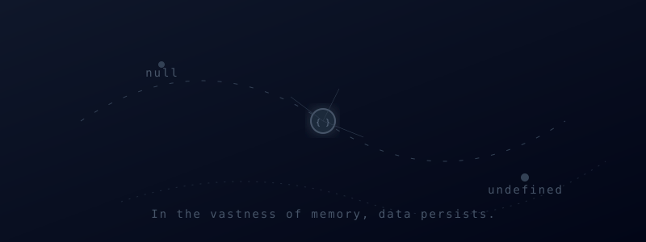

# 🚀 Mastering JSON: The Definitive Learning Path

  

Welcome to the ultimate resource for learning JSON. This repository is designed as a staircase, not a pile of notes. Each lesson builds upon the last, giving you a complete mental model of how JSON works in the real world. All examples are completely self-contained within the lessons.

  

## 🗂️ Foundation

Start here if you are completely new to JSON.

1. [00 - Start Here](./00-start-here.md)
2. [01 - What Is JSON](./01-what-is-json.md)
3. [02 - Core Syntax](./02-core-syntax.md)
4. [03 - Data Model](./03-data-model.md)
5. [04 - Valid vs Invalid JSON](./04-valid-vs-invalid.md)

## 🛠️ Working Level

Learn how JSON is used in applications and APIs.

6. [05 - Working with JSON](./05-working-with-json.md)
7. [06 - JSON and APIs](./06-json-and-apis.md)
8. [07 - JSON Schema and Validation](./07-json-schema-validation.md)
9. [08 - Transform, Merge, and Patch](./08-transform-merge-patch.md)

## 🚀 Advanced Level

Master real-world patterns, security, and performance.

10. [09 - Large JSON and JSONL](./09-large-json-and-jsonl.md)
11. [10 - Security and Reliability](./10-security-reliability.md)
12. [11 - Real-World Patterns](./11-real-world-patterns.md)
13. [12 - Advanced Design](./12-advanced-design.md)
14. [13 - Glossary](./13-glossary.md)

## 📅 Suggested Timelines

**If you are brand new:**
- **Day 1:** Lessons 00 to 04
- **Day 2:** Lesson 05
- **Day 3:** Lessons 06 and 07
- **Day 4:** Lessons 08 and 09
- **Day 5:** Lessons 10 to 13

**If you already use JSON regularly:**
- **Session 1:** Lessons 03, 06, and 07
- **Session 2:** Lessons 08, 09, and 10
- **Session 3:** Lessons 11 and 12

Dive right in and start learning!